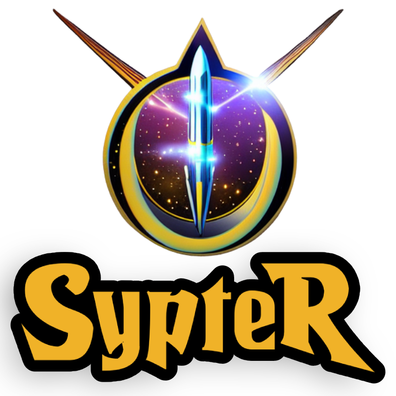

<a name="readme-top"></a>
<!-- PROJECT SHIELDS -->
<!--
*** I'm using markdown "reference style" links for readability.
*** Reference links are enclosed in brackets [ ] instead of parentheses ( ).
*** See the bottom of this document for the declaration of the reference variables
*** for contributors-url, forks-url, etc. This is an optional, concise syntax you may use.
*** https://www.markdownguide.org/basic-syntax/#reference-style-links
-->
<div align="center">

[![Contributors][contributors-shield]][contributors-url]
[![Forks][forks-shield]][forks-url]
[![Stargazers][stars-shield]][stars-url]
[![Issues][issues-shield]][issues-url]
[![MIT License][license-shield]][license-url]
</div>

<!-- PROJECT LOGO -->
<br />
<div align="center">
  <a href="https://github.com/temurchichua/sypter">
    
  </a>

  <h3 align="center">SypteR</h3>

  <p align="center">
    Sypter is a simple front-end testing tool-set for Python
    <br />
    <a href="https://github.com/temurchichua/sypter"><strong>Explore the docs »</strong></a>
    <br />
    <br />
    <a href="https://github.com/temurchichua/sypter">View Demo[coming up]</a>
    ·
    <a href="https://github.com/temurchichua/sypter/issues">Report Bug</a>
    ·
    <a href="https://github.com/temurchichua/sypter/issues">Request Feature</a>
  </p>
</div>


<!-- ABOUT THE PROJECT -->
## About The Project

[//]: # ([![Product Name Screen Shot][product-screenshot]]&#40;https://example.com&#41;)

Our team was in need to find a straightforward HTML element testing framework for Python. 
Unfortunately we didn't find one, so we decided to create our own.


<p align="right">(<a href="#readme-top">back to top</a>)</p>


### Built With
<div align="center">

[![Python][Python]][Python-url]
</div>

This section should list any major frameworks/libraries used to bootstrap your project. (Leave any add-ons/plugins for the <a href="#acknowledgments">Acknowledgments</a> section)


<p align="right">(<a href="#readme-top">back to top</a>)</p>


<!-- GETTING STARTED -->
## Getting Started

To get a local copy up and running follow these simple example steps.

### Prerequisites

* You need to have [Python](https://www.python.org/downloads/) installed on your machine. Please check the supported versions in build section.

### Installation

#### For Usage
You can use Pip to install the package from git with following command:

```sh
pip install git+https://github.com/temurchichua/sypter.git
```


#### For local development

1. Clone the repo
   ```sh
   git clone https://github.com/temurchichua/sypter.git
   ```
2. Create the virtual environment inside the repository. You can use [virtualenv](https://virtualenv.pypa.io/en/latest/) or [venv](https://docs.python.org/3/library/venv.html) for this purpose.
   ```sh
   python -m venv venv
   ```
3. Activate the virtual environment
    ```sh
    source venv/bin/activate
    ```
4. Install the dependencies
    ```sh
    pip install -r requirements.txt
    ```


<p align="right">(<a href="#readme-top">back to top</a>)</p>


<!-- USAGE EXAMPLES -->
## Usage

Use this space to show useful examples of how a project can be used. Additional screenshots, code examples and demos work well in this space. You may also link to more resources.

_For more examples, please refer to the [Documentation](https://example.com)_

<p align="right">(<a href="#readme-top">back to top</a>)</p>


<!-- ROADMAP -->
## Roadmap

To Be Added
- [ ] Feature 1
    - [ ] Nested Feature

See the [open issues](https://github.com/temurchichua/sypter/issues) for a full list of proposed features (and known issues).

<p align="right">(<a href="#readme-top">back to top</a>)</p>


<!-- CONTRIBUTING -->
## Contributing

Contributions are what make the open source community such an amazing place to learn, inspire, and create. Any contributions you make are **greatly appreciated**.

If you have a suggestion that would make this better, please fork the repo and create a pull request. You can also simply open an issue with the tag "enhancement".
Don't forget to give the project a star! Thanks again!

1. Fork the Project
2. Create your Feature Branch (`git checkout -b feature/AmazingFeature`)
3. Commit your Changes (`git commit -m 'Add some AmazingFeature'`)
4. Push to the Branch (`git push origin feature/AmazingFeature`)
5. Open a Pull Request

<p align="right">(<a href="#readme-top">back to top</a>)</p>


<!-- LICENSE -->
## License

Distributed under the GNU GPLv3 . See [LICENSE][license-url] for more information.

<p align="right">(<a href="#readme-top">back to top</a>)</p>


<!-- CONTACT -->
## Contact

[Temur Chichua][linkedin-url] - [@TemurChichua](https://twitter.com/TemurChichua) - contact@temurchichua.me

Project Link: [https://github.com/temurchichua/sypter](https://github.com/temurchichua/sypter)

<p align="right">(<a href="#readme-top">back to top</a>)</p>


<!-- ACKNOWLEDGMENTS -->
## Acknowledgments

* [Logo created using DreamStudio AI](https://beta.dreamstudio.ai)
* [Readme based on the Best-README-Template](https://github.com/othneildrew/Best-README-Template)

<p align="right">(<a href="#readme-top">back to top</a>)</p>


<!-- MARKDOWN LINKS & IMAGES -->
<!-- https://www.markdownguide.org/basic-syntax/#reference-style-links -->
[contributors-shield]: https://img.shields.io/github/contributors/temurchichua/sypter.svg?style=for-the-badge
[contributors-url]: https://github.com/temurchichua/sypter/graphs/contributors
[forks-shield]: https://img.shields.io/github/forks/temurchichua/sypter.svg?style=for-the-badge
[forks-url]: https://github.com/temurchichua/sypter/network/members
[stars-shield]: https://img.shields.io/github/stars/temurchichua/sypter.svg?style=for-the-badge
[stars-url]: https://github.com/temurchichua/sypter/stargazers
[issues-shield]: https://img.shields.io/github/issues/temurchichua/sypter.svg?style=for-the-badge
[issues-url]: https://github.com/temurchichua/sypter/issues
[license-shield]: https://img.shields.io/github/license/temurchichua/sypter.svg?style=for-the-badge
[license-url]: https://github.com/temurchichua/sypter/blob/master/LICENSE
[linkedin-shield]: https://img.shields.io/badge/-LinkedIn-black.svg?style=for-the-badge&logo=linkedin&colorB=555
[linkedin-url]: https://linkedin.com/in/temur-chichua
[product-screenshot]: resources/images/screenshot.png
[Python]: https://img.shields.io/badge/Python-3776AB?style=for-the-badge&logo=python&logoColor=white
[Python-url]: https://www.python.org/
